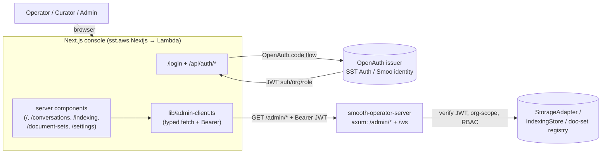

<p align="center">
  
</p>

<h1 align="center">Smooth Operator — Management Console</h1>

The **management console** for `smooth-operator` (Phase 12, increment 2): a
Next.js 15 (App Router, TypeScript, Tailwind) admin UI that consumes the
auth-gated [`/admin/*` API](../docs/ADMIN-API.md) — whoami, chat history,
indexing status, and document sets — with org-scoping and RBAC inherited from the
backend.

It is a **pure read client** of the admin API. Every page is a server component
that constructs a typed [`AdminClient`](./lib/admin-client.ts) bound to the
signed-in user's bearer token and renders the JSON. Write operations (connector
config, settings CRUD) land in increment 3 once the admin API grows write
endpoints.



---

## Quickstart (dev)

Point the console at a local `smooth-operator-server` running with
`AUTH_MODE=none` (a fixed Admin principal — no token needed) and a seeded KB:

```bash
# 1. Boot the backend (from the repo's rust/ dir; build the binary if missing:
#    cargo build -p smooai-smooth-operator-server --bin smooth-operator-server)
AUTH_MODE=none SMOOTH_AGENT_PORT=8840 SMOOTH_AGENT_SEED_KB=1 \
  ~/.cargo/shared-target/debug/smooth-operator-server

# 2. Boot the console in dev-auth mode pointed at it
cd console
pnpm install
CONSOLE_AUTH=dev ADMIN_API_URL=http://127.0.0.1:8840 pnpm dev
# → http://localhost:3000  → "Continue as Admin"
```

In dev mode the login form mints a local session whose admin-API bearer is the
literal `dev`, which an `AUTH_MODE=none` server accepts. The dashboard then
reflects the fixed Admin principal returned by `/admin/me` and the seeded
`policies` document set.

---

## Auth modes

The console supports the same auth duality as the backend, switched by
`CONSOLE_AUTH`:

| Mode | `CONSOLE_AUTH` | Backend `AUTH_MODE` | How it works |
| --- | --- | --- | --- |
| **OpenAuth (BYO)** | *(default / `openauth`)* | `jwt` | `/api/auth/login` redirects to the SST OpenAuth issuer (OAuth code flow). `/api/auth/callback` exchanges the code for the OpenAuth-issued JWT (carrying `sub`/`org`/`role`), stored in an httpOnly session cookie and forwarded as the admin-API bearer. |
| **Smoo identity (hosted)** | `openauth` | `smoo` | Identical flow, but `OPENAUTH_ISSUER` points at Smoo's hosted issuer (`lom.smoo.ai`) instead of a self-hosted `sst.aws.Auth`. Same JWT contract. |
| **Dev** | `dev` | `none` | A username form mints a local session with the bearer `dev`. Only reachable when `CONSOLE_AUTH=dev`; never the production default. Used by the smoke test. |

The console **never trusts the token itself** — it only forwards it. The admin
API re-verifies the JWT on every request (its `JwtVerifier`), which is the real
trust boundary. The OpenAuth path decodes the JWT payload only for a display
hint (signed-in name/role), and the role is also re-resolved live via
`/admin/me` in the app layout.

### Role-awareness (RBAC)

The signed-in role (`admin` ≥ `curator` ≥ `basic`) drives the UI:

- The **header** shows the user, org, and a role badge.
- The **sidebar** hides Curator-only sections (Indexing) from Basic users
  ([`lib/rbac.ts`](./lib/rbac.ts)).
- The **dashboard** shows knowledge cards only to Curator+; a Basic user sees a
  "available to Curator and Admin" notice instead.
- Any `403` from the admin API (e.g. a Basic user reaching a Curator surface)
  renders as a friendly "Insufficient permissions" error rather than a raw code.

---

## Pages

| Route | What |
| --- | --- |
| `/` | Dashboard — overview cards: conversation count, signed-in user/role (`/admin/me`), document-set + indexing summaries (Curator+), recent indexing activity. |
| `/conversations` | Paged conversation list (offset paging via `nextCursor`). |
| `/conversations/[id]` | Conversation detail — the message transcript (`/admin/conversations/{id}/messages`). |
| `/indexing` | Indexing runs table (Curator+) — status, counts, cursor, started/finished. |
| `/document-sets` | Document set cards — names + document counts (Curator+). |
| `/settings` | Read-only config (model, gateway, auth mode, backend health). CRUD = increment 3. |
| `/login`, `/api/auth/*` | Auth: dev login server action; OpenAuth login/callback/signout route handlers. |

Every data page handles loading / empty / error states explicitly.

---

## Admin API client

[`lib/admin-client.ts`](./lib/admin-client.ts) is a typed fetch wrapper over each
`/admin/*` endpoint. It takes a base URL + bearer token, sends
`Authorization: Bearer <token>`, parses into the shapes declared in
[`lib/types.ts`](./lib/types.ts) (mirroring the Rust serde output — camelCase),
and throws a typed `AdminApiError` (carrying HTTP status + protocol error code)
on failure so UI code branches on `isUnauthorized` / `isForbidden` / `isNotFound`
without re-parsing the body. The domain shapes (`Conversation`, `Message`,
`ContentItem`, `ParticipantRef`) match the published `@smooai/smooth-operator`
client so the two can be unified later.

---

## Tests

A live Playwright smoke test ([`e2e/console.smoke.spec.ts`](./e2e/console.smoke.spec.ts)),
gated on `SMOOTH_AGENT_E2E=1` like the repo's other live tests. It boots the
`smooth-operator-server` (`AUTH_MODE=none`, `SMOOTH_AGENT_SEED_KB=1`, port 8840),
`next start`s the console (`CONSOLE_AUTH=dev`) against it, signs in via the dev
login, and asserts the dashboard renders the Admin principal + the seeded
`policies` document set. It skips cleanly without the env and never prints
secrets.

```bash
pnpm build                       # next build (required — the test next-starts the build)
SMOOTH_AGENT_E2E=1 pnpm test:e2e
```

```bash
pnpm typecheck   # tsc --noEmit
pnpm lint        # next lint
pnpm build       # next build
```

---

## SST deploy

[`sst.config.ts`](./sst.config.ts) declares an `sst.aws.Nextjs` (OpenNext →
Lambda + CloudFront) for the console, an `sst.aws.Auth` for the BYO OpenAuth
issuer, and wires the admin API URL + issuer URL into the site env. **Never
deploy locally** — CI owns deploys; verification here is `tsc` / `sst` synth.

The reusable wiring could later move into a `Console` construct in
`@smooai/deploy` (alongside the existing `SmoothAgentApi`). Env the deploy sets:

| Env | Meaning |
| --- | --- |
| `CONSOLE_AUTH` | `openauth` (prod) — the dev path is never deployed. |
| `ADMIN_API_URL` | Base URL of the running `smooth-operator-server`. |
| `OPENAUTH_ISSUER` | The SST OpenAuth issuer URL (or `lom.smoo.ai` for hosted Smoo identity). |
| `OPENAUTH_CLIENT_ID` | The OpenAuth client id. |
| `BACKEND_AUTH_MODE` | The backend's auth mode (display, settings page). |

---

## Increment 3 (next)

- Connector configuration (add / edit / trigger re-index).
- Settings write (model / gateway / auth) — needs new admin **write** endpoints.
- Document-set management (rename / delete / re-tag).
- Wire the real `sst.aws.Auth` issuer Lambda + the `SmoothAgentApi` URL output.
